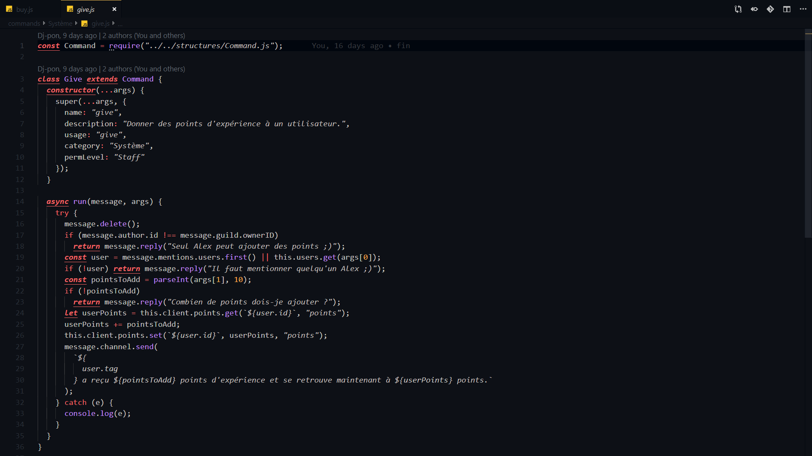

  

# [getCodingKnowledge Theme](https://marketplace.visualstudio.com/items?itemName=aolland.gckn-theme)

Le thème que j'utilise [dans mes vidéos](https://www.youtube.com/c/getcodingknowledge) depuis le 09/05/2019.

[GitHub repository](https://github.com/Binaryify/OneDark-Pro)

> Vous pouvez retrouvez l'extension directement sur GitHub ou le marché de VS Code: [GitHub](https://github.com/aolland/gckn-theme) | [Marketplace](https://marketplace.visualstudio.com/items?itemName=aolland.gckn-theme)

# CHANGELOG

[CHANGELOG.MD](CHANGELOG.md)

# Langages

SS pour tous les langages disponibles. A ce jour, uniquement le Javascript, le JSON et le Markdown sont disponibles.

## Javascript

## JSON

## Markdown

